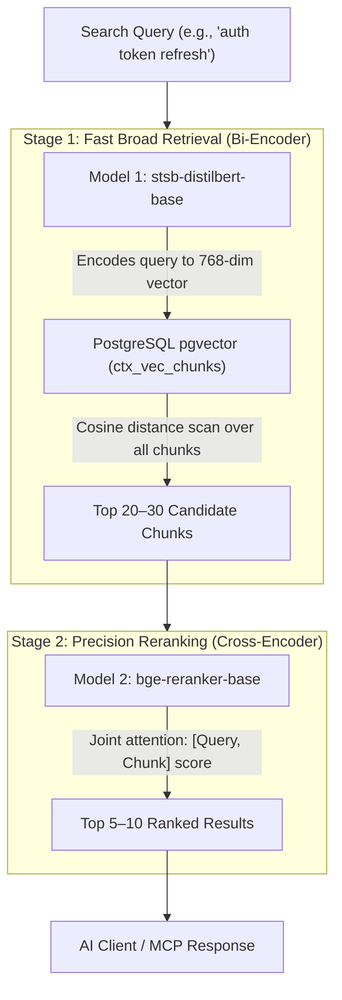

# Machine Learning Models & Two-Stage Semantic Search

Savant Server incorporates an in-process, two-stage semantic code search pipeline to allow AI agents (such as Claude, Copilot, and Antigravity) to query codebases by meaning rather than simple lexical keyword matching.

The server operates **completely locally** without external LLM/embedding API dependencies (no OpenAI/Anthropic network calls or billing for search). It relies on two local PyTorch/Transformer models managed via `sentence-transformers`.

---

## Architecture: Two-Stage Retrieval Pipeline

Semantic search over large code repositories requires balancing **low latency** across hundreds of thousands of code chunks with **high ranking precision**. A single model cannot achieve both efficiently:

1. **Bi-Encoders (Embeddings)** are extremely fast at retrieval because code chunks are pre-vectorized once and queried via vector math, but they lack deep query-to-document token interaction.
2. **Cross-Encoders (Rerankers)** have near-human ranking accuracy by scoring query and document tokens together, but are far too computationally expensive to run across an entire repository.

Savant combines both in a two-stage pipeline:



---

## Model Specifications

### Model 1: Embedding Model (`stsb-distilbert-base`)
* **Role**: Stage 1 Fast Filter / Candidate Retrieval
* **Architecture**: Bi-Encoder (`sentence_transformers.SentenceTransformer`)
* **Source / Weights**: Hugging Face `sentence-transformers/stsb-distilbert-base`
* **Output**: 768-dimensional float32 vector
* **Source Code**: [`context/embeddings.py`](../context/embeddings.py)
* **Lifecycle**:
  - **Indexing**: During repository indexing (`context.job_worker`), code files are chunked and converted into 768-dim vectors, then stored in the `ctx_vec_chunks` table in PostgreSQL (`pgvector`).
  - **Search**: When a query arrives, it is embedded into a 768-dim vector and compared using HNSW index cosine distance (`<=>`).
* **Storage & Download**:
  - Default download directory: `~/.savant/models/stsb-distilbert-base/v1` or overridden via `EMBEDDING_MODEL_DIR`.
  - Automatically downloaded from Hugging Face on first use if not present.
* **Memory & Footprint**: ~260 MB disk, ~500 MB–1 GB RAM.

---

### Model 2: Reranker Model (`bge-reranker-base`)
* **Role**: Stage 2 Precision Ranking / Re-scoring
* **Architecture**: Cross-Encoder (`sentence_transformers.CrossEncoder`)
* **Source / Weights**: BAAI `BAAI/bge-reranker-base`
* **Input**: Concatenated `[Query, Code Chunk]` pair
* **Output**: Continuous relevance score (float)
* **Source Code**: [`context/reranker.py`](../context/reranker.py)
* **Lifecycle**:
  - Receives the top candidate chunks (typically 20–30) from Stage 1.
  - Scores every pair jointly through full cross-attention layers.
  - Re-sorts candidates by `rerank_score` descending and returns `top_k` (e.g. 5–10).
* **Storage & Packaging**:
  - Bundled directly in the codebase under `models/bge-reranker-base/v1` and baked into the Docker image via `Dockerfile`.
  - Configured via `RERANKER_MODEL_DIR=/app/models/bge-reranker-base/v1`.
* **Memory & Footprint**: ~1.11 GB disk (`model.safetensors`), ~1.5 GB–2 GB RAM during inference.

---

## Comparison Summary

| Metric / Aspect | Model 1: `stsb-distilbert-base` | Model 2: `bge-reranker-base` |
| :--- | :--- | :--- |
| **Pipeline Stage** | Stage 1 (Candidate Generation) | Stage 2 (Precision Reranking) |
| **Model Type** | Bi-Encoder | Cross-Encoder |
| **Input Format** | Single string (Query or Chunk) | Pair: `[Query, Chunk]` |
| **Output Format** | Vector (`vector(768)`) | Scalar Score (`float`) |
| **Candidate Space** | 100% of indexed chunks | Top 20–30 candidates only |
| **Disk Footprint** | ~260 MB | ~1.11 GB |
| **Bundled in Docker?** | Optional volume download / PVC | Baked directly into container image |
| **Environment Toggle** | Required for vector search | `SAVANT_ENABLE_RERANKER=1` (set `0` to bypass) |

---

## Kubernetes & Production Deployment Guide

When deploying Savant Server to Kubernetes (`k8s`), consider the following:

### 1. Resource Allocations (Memory & CPU)
Both models run on CPU via PyTorch. Concurrently serving Gunicorn web workers and background indexing jobs requires adequate RAM to avoid `OOMKilled` (Exit Code 137):

```yaml
resources:
  requests:
    cpu: "1000m"
    memory: "3Gi"
  limits:
    cpu: "2000m"
    memory: "6Gi"
```

### 2. Air-Gapped / Egress-Restricted Clusters
* **Reranker**: Baked into `/app/models/bge-reranker-base` in the image. No internet egress needed.
* **Embeddings**: In clusters without internet access to Hugging Face (`huggingface.co`), pre-populate the model files into the PersistentVolume mounted at `EMBEDDING_MODEL_DIR` (e.g., `/data/savant/models-v1`), or add `COPY` into your custom Dockerfile layer.

### 3. PostgreSQL & pgvector Requirement
The database must have the `pgvector` extension enabled, and vector dimensions must match `EMBEDDING_DIM=768`:
```sql
CREATE EXTENSION IF NOT EXISTS vector;
```

### 4. Low-Resource Environments
To run Savant Server in memory-constrained environments (<3 GB RAM), the reranker can be disabled:
```yaml
env:
  - name: SAVANT_ENABLE_RERANKER
    value: "0"
```
When disabled, search results are ordered directly by the Stage 1 vector cosine similarity.
